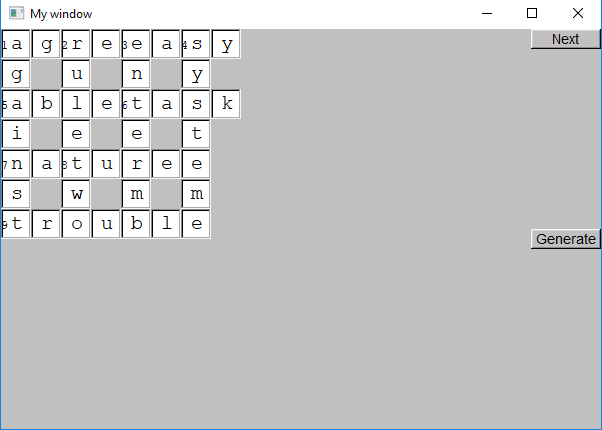

//this must be in  project property Linker->Input->Additional Dependencies 
//configuration Release and debug

fltk.lib          
fltkpng.lib       
fltkzlib.lib      
fltkjpeg.lib      
fltkimages.lib    
fltkgl.lib        
opengl32.lib      
comctl32.lib      
__________________________________________________________________________________________________________________________________________
crossword generator 

__________________________________________________________________________________________________________________________________________
maze Randomized Prim's algorithm 
Maze generation algorithms  
C++ program to solve Rat in a Maze problem using backtracking 

__________________________________________________________________________________________________________________________________________
mario game  
Code blocks project  

