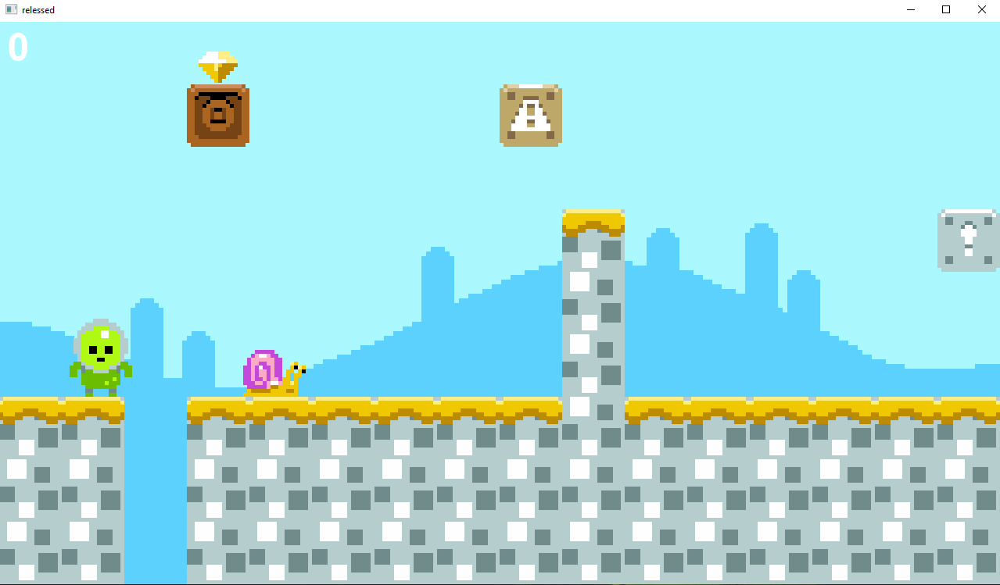
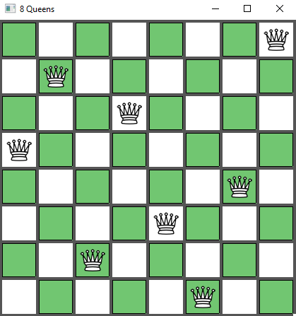
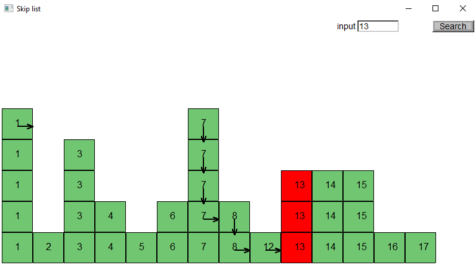
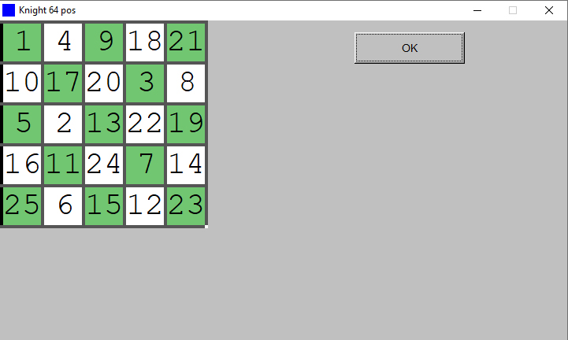
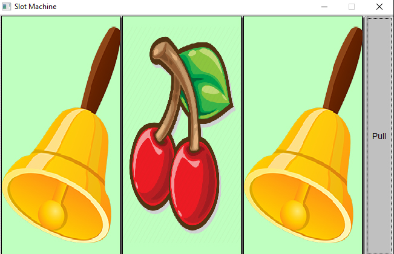
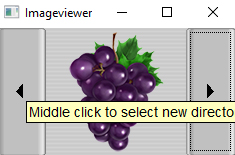
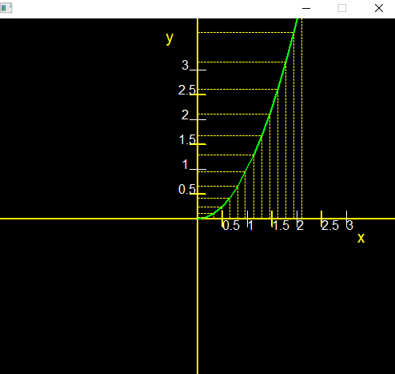
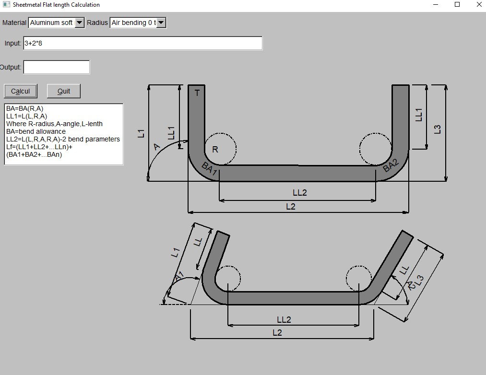
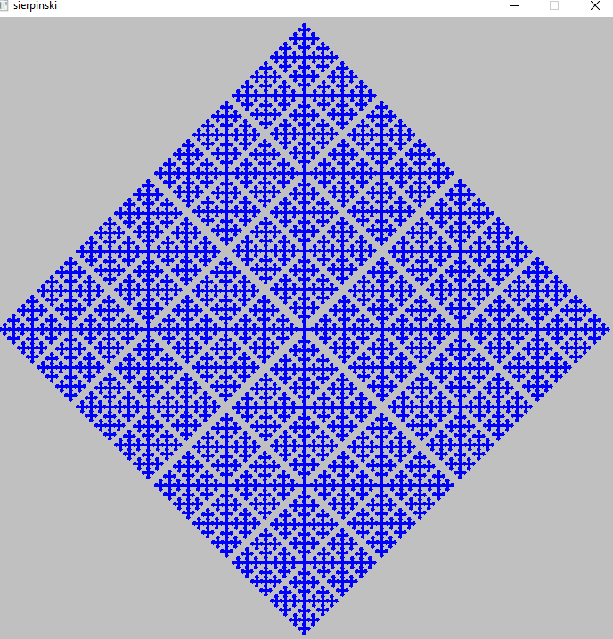
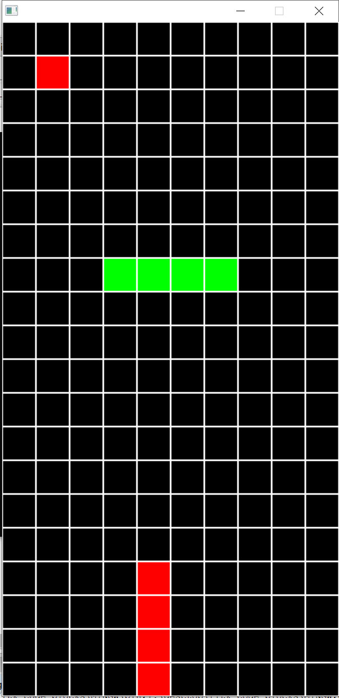

//this must be in  project property Linker->Input->Additional Dependencies 
//configuration Release and debug

fltk.lib          
fltkpng.lib       
fltkzlib.lib      
fltkjpeg.lib      
fltkimages.lib    
fltkgl.lib        
opengl32.lib      
comctl32.lib      
__________________________________________________________________________________________________________________________________________
crossword generator 

__________________________________________________________________________________________________________________________________________
maze Randomized Prim's algorithm 
Maze generation algorithms  
C++ program to solve Rat in a Maze problem using backtracking 

__________________________________________________________________________________________________________________________________________
mario game  
Code blocks project  

__________________________________________________________________________________________________________________________________________

8 queen problem. The eight queens problem is the problem of placing eight queens on an 8×8 chessboard 
such that none of them attack one another (no two are in the same row, column, or diagonal). 
More generally, the n queens problem places n queens on an n×n chessboard.  
__________________________________________________________________________________________________________________________________________

Skip lists are a probabilistic data structure 
that seem likely to supplant balanced trees as the implementation method of choice for many applications. 
Skip list algorithms have the same asymptotic 
expected time bounds as balanced trees and are simpler, faster and use less space.  
__________________________________________________________________________________________________________________________________________

A knight's tour is a sequence of moves of a knight on a chessboard such that the knight visits every square exactly once. 
If the knight ends on a square that is one knight's move from the beginning square (so that it could tour the board again immediately, 
following the same path), the tour is closed; otherwise, it is open.  
__________________________________________________________________________________________________________________________________________

Slot machine is a game of chance.  
__________________________________________________________________________________________________________________________________________

views pictures from directory selection, supports unicode uses win32 api as file selection, automatically resizes the window to fit the 
picture  
__________________________________________________________________________________________________________________________________________

the graph y=pow(x) can change the value when you press the up or down buttons  
__________________________________________________________________________________________________________________________________________

Line–line intersection. The red dot represents the point at which the two lines intersect.  
__________________________________________________________________________________________________________________________________________

Sheetmetal Flat length Calculation used for Bending.  
__________________________________________________________________________________________________________________________________________

The Sierpinski triangle is a fractal attractive fixed set with the overall shape of an equilateral triangle, subdivided recursively into 
smaller equilateral triangles.  

Tetris not complited 